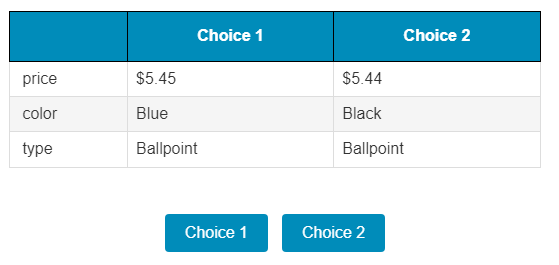

# BACE Integration

:warning: ALPHA VERSION: Still in development.

## Description

This field plug-in can be used to perform a Bayesian Adaptive Choice Experiment (BACE, [Drake, Payró, Thakral, and Tô 2023](https://github.com/tt-econ/bace)) within SurveyCTO.

:warning: Internet connectivity is required in order to integrate BACE within SurveyCTO at this time.

BACE allows researchers to perform adaptive discrete choice experiments that can elicit preference parameters quickly and efficiently.

### Features

This plug-in allows you to integrate BACE with Survey CTO.

Before installing this plug-in with your survey, you will need to create and deploy your own BACE application.

### Data Format

The field stores a pipe (`|`) separated list of the options presented to the respondent; the final element of the string records the index of the option that was selected by the respondent.
(Note that options are zero-indexed so `0` -> Profile 1, `1` -> Profile 2, ...)

The field plug-in maps this string to display a table of choices to the user.

Consider the following field:

    "Price,$2.25,$3.00|Ink Color,blue,black|Pen Type,Ballpoint,Gel|1"

The experiment displayed to the user would reflect the information shown in the table below. The final element of the string indicates that Profile 2 was selected by the repsondent.

| | Profile 1 | Profile 2 |
| --- | --- | --- |
| Price | $2.25 | $3.00 |
| Ink Color | Blue | Black |
| Pen Type | Ballpoint | Gel |

## How to use

(Very basic instructions that still need to be updated)

Step 0) Set up your own BACE application prior to running this.

Step 1) Download the survey components.

- Download the [survey from definition](https://github.com/mhdrake/bace_surveycto/blob/main/BACE%20Example.xlsx)
- Download the [BACE field plug-in](https://github.com/mhdrake/bace_surveycto/blob/main/bace.fieldplugin.zip).

Step 1) Create a new Survey CTO form.

- Navigate to the Design tab from Survey CTO.
- Click to "Add Form, Group, or Dataset" (Plus bar near existing forms).
- Click "Upload form definition"
  - Add the survey form definition to the Form definition section.
  - Select "Attach filed?" -> "Yes"
    - Add the bace.fieldplugin.zip file to this.
  - Mark whether you want to deploy the survey immediately or upload as a draft.
  - Click "Upload"
- Update the field plug-in parameters (See section below.)
  - Make sure to update the bace_url function with the url to the /surveyCTO route on your application.
  This is necessary to connect the plug-in with your application.
  - Update additional parameters by editing the bace_response question.
    - Scroll down to the field titled bace_response
    - Click "Edit this field"
    - Update the plug-in parameters.
    Add a comma separated list of key = value.
    To reference variables from other fields, use ${variable_name}.
    Otherwise, input the value.
    - Click 'Save now' to save changes.

Once you have set this up, your survey cto form is connected to your BACE application.

### Getting started

1. Download the [sample form](https://github.com/mhdrake/bace_surveycto/blob/main/BACE%20Example.xlsx) from this repo and upload it to your SurveyCTO server.
2. Download the [bace.fieldplugin.zip file](https://github.com/mhdrake/bace_surveycto/blob/main/bace.fieldplugin.zip) from this repo, and attach it to the test form on your SurveyCTO server.
3. Make sure to provide the correct parameters (see below).

### Parameters

| Key | Value |
| --- | --- |
| `bace_url` (required) | String. Specifies the url to your BACE application. It should specify the https://\<your-bace-url\>/surveyCTO route. |
| `unique_profile_id` (required) | String. A unique uuid that is associated with an individual. By default, this is created using `once(uuid())` in a calculate field at the start of your survey. |
| `previous_choice` (required) | String. The choice selected by the respondent on the previous question. Calculated within a repeat group as `if(index()=1, null, indexed-repeat(${selected_choice}, ${bace_repeat}, index() - 1))`. |
| `final_question` (required) | Integer (1/0). Indicates whether this is the final API call. Survey example calculates this as `index() = ${n_scenarios} + 1`. |
| `split_to_rows` (optional) | String. Defaults to `\|`. Separator for breaking response into table rows. |
| `split_to_vars` (optional) | String. Defaults to `:`. Separator for breaking a row into columns. |
| `n_options` (optional) | Int. Defaults to `2`. Number of choice options to display to the respondent. |
| `button_label` (optional) | String. Defaults to `Choice`. Label for each option. |
| `profile_enumerator` (optional) | String ("number" or "letter"). Defaults to number. Indicates how options should be enumerated. number -> Option 1, Option 2, ... or letter -> Option A, Option B, ... |
| `loading_message` (optional) |  String. Message to display to users while BACE questions load. Defaults to "Your choice scenario is loading.\nWe appreciate your patience." |
| `answers` (optional) | Comma-separated string of answer values. Defaults to "0,1". This should map to the `answers` variable that is defined in the `user_config.py` file from your BACE application. |
| `buttons_per_row` (optional) | Int. Defaults to 3. Formats the number of answer buttons per row. |

### Examples

Here is an example *appearance* for your *text* field that uses this field plug-in: 

## More Resources Provided by SurveyCTO

* **Sample form**  
This form will help you explore the features in this field plug-in.  
[Download sample form.](https://github.com/mhdrake/bace_surveycto/blob/main/BACE%20Example.xlsx)

* **Developer documentation**  
Instructions and resources for developing your own field plug-ins.  
[https://github.com/surveycto/Field-plug-in-resources](https://github.com/surveycto/Field-plug-in-resources)

* **User documentation**  
How to get started using field plug-ins in your SurveyCTO form.  
[https://docs.surveycto.com/02-designing-forms/03-advanced-topics/06.using-field-plug-ins.html](https://docs.surveycto.com/02-designing-forms/03-advanced-topics/06.using-field-plug-ins.html)

## Acknowledgments

Initial code for this plug-in was built using logic from [Survey CTO's conjoing field plug-in](https://github.com/surveycto/conjoint/).